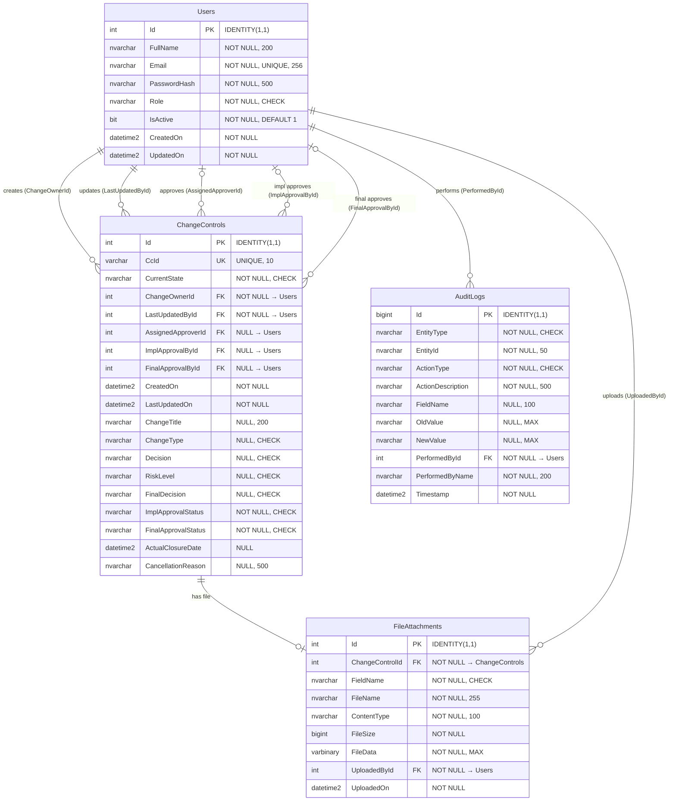

# SECTION 2 — Entity Relationship Diagram

---

## 2.1 ER Diagram

The following Mermaid ER diagram shows all 4 tables, their key columns, and the relationships between them. The ChangeControls table shows a representative subset of columns (key fields and all FKs) — the full 49-column definition is in Section 3.2.

**Diagram notes:**

- ChangeControls shows a representative subset — 19 of its 49 columns are displayed (all FKs, system fields, and key CHECK-constrained fields). The full 49-column definition is in Section 3.2.
- `||--o{` = one-to-many (mandatory on the "one" side). Example: every ChangeControl must have a ChangeOwnerId.
- `|o--o{` = one-to-many (optional on the "one" side). Example: a ChangeControl may or may not have an AssignedApproverId yet.
- `||--o|` = one-to-zero-or-one. Example: a ChangeControl has 0, 1, or 2 FileAttachment rows (one per upload field).

---

## 2.2 Relationship Summary

The database has **8 foreign key relationships** across 4 tables. All FKs reference the surrogate `Id` column (INT) of the parent table.

### 2.2.1 ChangeControls → Users (5 foreign keys)

| # | FK Column | References | Nullable | Purpose | BRD Field |
|---|-----------|-----------|----------|---------|-----------|
| 1 | `ChangeOwnerId` | Users.Id | NOT NULL | The user who created this CC record. Set once at creation, never changes. | Field 3: Change Owner |
| 2 | `LastUpdatedById` | Users.Id | NOT NULL | The user who most recently saved, submitted, or performed a workflow action. Updated on every modification. | Field 4: Last Updated By |
| 3 | `AssignedApproverId` | Users.Id | NULL | The Approver selected by the CC Owner. NULL during draft state before assignment. Once assigned, the same Approver handles both approval gates (BR-8.3.3). | Field 35: Assign Approver |
| 4 | `ImplementationApprovalById` | Users.Id | NULL | System-populated with the Approver's ID when Decision = 'Approve' at the Implementation Approval gate. NULL until approval. Not populated on rejection (BR-8.3.9). | Field 40: Implementation Approval By |
| 5 | `FinalApprovalById` | Users.Id | NULL | System-populated with the Approver's ID when Final Decision = 'Approve' at the Final Approval gate. NULL until final approval. Not populated on rejection (BR-8.3.9). | Field 44: Final Approval By |

**Design note:** Fields 3 and 4 (Change Owner, Last Updated By) display the user's **full name** in the UI, not their ID. The C# service layer resolves the name via a JOIN or Include when building the API response. This keeps the FK as a clean INT reference while allowing name display.

**Why ChangeOwnerId is NOT NULL but AssignedApproverId is NULL:** A CC record always has an owner (the creator), but the Approver may not be assigned yet during draft state. The CC Owner selects the Approver as one of the 25 editable fields, and can Save Draft before making that selection.

### 2.2.2 FileAttachments → ChangeControls (1 foreign key)

| # | FK Column | References | Nullable | Purpose |
|---|-----------|-----------|----------|---------|
| 6 | `ChangeControlId` | ChangeControls.Id | NOT NULL | Links the uploaded file to its parent CC record. |

Combined with the UNIQUE constraint on `(ChangeControlId, FieldName)`, this ensures at most one file per upload field per CC record (max 2 rows per CC: one for 'SupportingDocuments', one for 'ImplementationEvidence').

### 2.2.3 FileAttachments → Users (1 foreign key)

| # | FK Column | References | Nullable | Purpose |
|---|-----------|-----------|----------|---------|
| 7 | `UploadedById` | Users.Id | NOT NULL | The user who uploaded this file. Always the CC Owner (only CC Owners can upload files per the Security Matrix). |

### 2.2.4 AuditLogs → Users (1 foreign key)

| # | FK Column | References | Nullable | Purpose |
|---|-----------|-----------|----------|---------|
| 8 | `PerformedById` | Users.Id | NOT NULL | The user who performed the audited action. Every audit entry must have a performing user. |

**Why AuditLogs does NOT have an FK to ChangeControls or Users for the audited entity:**

The `EntityId` column stores the business identifier as a string (e.g., 'CC-001', 'User-123'), not the surrogate INT key. This is a deliberate design decision:

- AuditLogs tracks actions on multiple entity types (`EntityType` = 'ChangeControl' or 'User'). A single FK column cannot reference two different parent tables.
- Audit records are immutable and self-contained — they must remain meaningful even if the referenced entity's schema evolves in future phases.
- The `EntityType` + `EntityId` combination provides a queryable reference without FK coupling. The composite index `IX_AuditLogs_EntityType_EntityId` supports efficient lookups.
- The `PerformedById` FK is retained because "who performed the action" is always a user, and we always need referential integrity on that relationship.

---

## 2.3 Cardinality Notes

| Relationship | Cardinality | Explanation |
|-------------|-------------|-------------|
| Users → ChangeControls (ChangeOwnerId) | 1 : 0..N | One user can own zero or many CC records. Every CC has exactly one owner. |
| Users → ChangeControls (LastUpdatedById) | 1 : 0..N | One user can be the last updater of zero or many CC records. Every CC has exactly one last updater. |
| Users → ChangeControls (AssignedApproverId) | 0..1 : 0..N | One user (with Approver role) can be assigned to zero or many CC records. A CC has zero or one assigned Approver (NULL during draft). |
| Users → ChangeControls (ImplementationApprovalById) | 0..1 : 0..N | One user can be the implementation approver on zero or many CC records. NULL until approval occurs. |
| Users → ChangeControls (FinalApprovalById) | 0..1 : 0..N | One user can be the final approver on zero or many CC records. NULL until final approval occurs. |
| ChangeControls → FileAttachments | 1 : 0..2 | One CC can have zero, one, or two file attachments (one per upload field). UNIQUE on (ChangeControlId, FieldName) enforces the upper bound of 1 per field. |
| Users → FileAttachments (UploadedById) | 1 : 0..N | One user can upload zero or many files. Every file has exactly one uploader. |
| Users → AuditLogs (PerformedById) | 1 : 0..N | One user can perform zero or many auditable actions. Every audit entry has exactly one performing user. |

**Practical cardinality scenarios:**

- A CC Owner with 10 active CC records appears in ChangeControls as `ChangeOwnerId` on 10 rows.
- An Approver assigned to 5 CC records appears as `AssignedApproverId` on 5 rows, plus potentially as `ImplementationApprovalById` and `FinalApprovalById` on the same or subset of those rows.
- A single approval action (e.g., Approver submits Decision = 'Approve' with Risk Level and Decision Comments) generates 4 AuditLog entries (3 field updates + 1 state transition), all referencing the same `PerformedById`.
- A CC record that goes through the full lifecycle (Created → Submitted → Approved → Implemented → Final Approved → Closed) generates approximately 10–15 audit log entries.

**Relationship constraints enforced by the application (C# service layer), not the database:**

- ChangeOwnerId must reference a user with Role = 'CC Owner' — the DB only enforces that it references a valid Users.Id, not the role.
- AssignedApproverId must reference a user with Role = 'Approver' — same as above, enforced in C#.
- ChangeOwnerId ≠ AssignedApproverId (segregation of duties) — enforced structurally by the single-role model and the role change restriction (BR-8.4.11), validated in C#.
- ImplementationApprovalById and FinalApprovalById should match the AssignedApproverId (same Approver for both gates per BR-8.3.3) — enforced in C#.

---

*End of Section 2*

---

**Section 2 Verification:**

- [x] Mermaid ER diagram code provided with all 4 tables and 8 FK relationships
- [x] Representative columns shown in diagram (all FKs, PKs, key fields)
- [x] All 8 FK relationships documented with FK column, target, nullability, purpose, and BRD field mapping
- [x] Rationale for AuditLogs not having FK to audited entities explained
- [x] Full cardinality table with all 8 relationships and plain-English explanations
- [x] Practical scenarios documented (how many audit entries per action, etc.)
- [x] Application-level relationship constraints noted (role checks in C#, segregation of duties)
